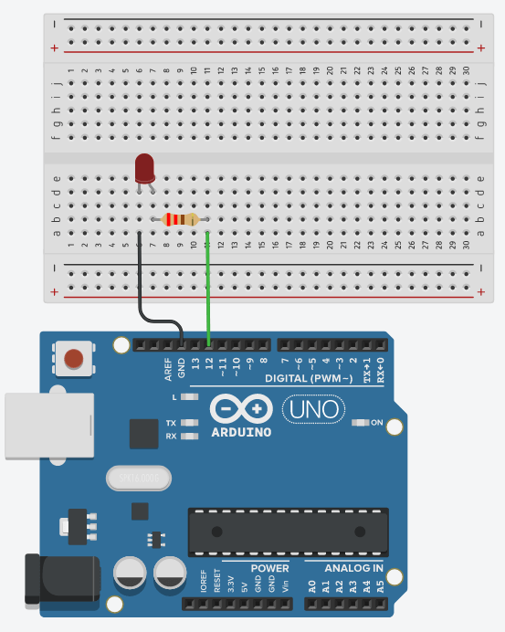
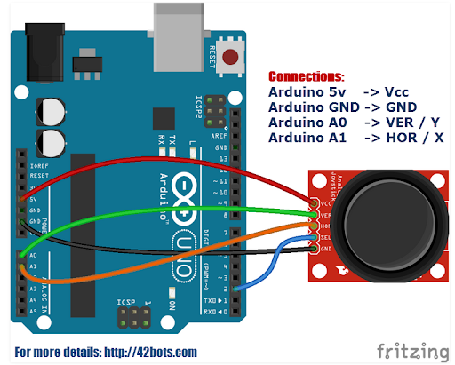

# CSC 2463 Final Project Documentation

## By: Shawn Russell

**Project Outline:**
  - Initialization and Project Description:
    - My original plan was to develop a game where you have enemies chasing after the user. I ended up deciding on a game of tag called "Catch me if you can". This game allows the user to control a character after pressing the start button, and the objective is to stay away from the enemies that spawn for as long as possible.

  - Planning:
    - For planning, I knew that I would need to create two different classes: user and enemy. Once the user clicks start, they would start in the middle of the 800 x 800 canvas they are provided. The enemy, however, would spawn in random parts of the canvas, making the user think of different ways to maneuver through the map every time. I also added sounds from "Tone.js" for every time that the user clicks one of the buttons I made in the start sequence and game over sequence.

    - For hardware, I decided to go with a joystick as the way that the user would control the character on the screen. An LED light was also used for when the user is controlling the joystick.
  - Execution: 
    - Some problems I was running into was getting the Serial port/Arduino to connect to my JavaSript code. I finally got it to work when I fixed some delay problems. At first, the user wouldn't be able to move until 5 or 6 seconds into the game. But with a few tweaks to my JavaScript program, the user moves with absolute swiftness and quickness. 

**Project Images**

- As you can see here, these elements are what I used to wire my hardware for this project. The way that they worked was importing a library called "WebSerial.js" that connects things like VsCode and Arduino together so that they can send messages to one another when the user does something.

**Youtube Demonstration Link:**

[Video Demonstration of game and Hardware](https://youtube.com/shorts/QWUFTRAT84c?si=_x4SyoHQ1hIQBjzy)

**Visual Representation of Hardware:**

**Future Development Ideas:**
- I would definitely consider having a "3 lives" system where every time the user dies they would have another life to try again until they got to 0 lives then iti would launch the game over sequence. With this, I would definitly add more LEDs to the Arduino to symbolize those lives being taken once the user is tagged. This would make the game more modern and interactive. I also would put more music in the game other than just having sounds go off when you press a button.